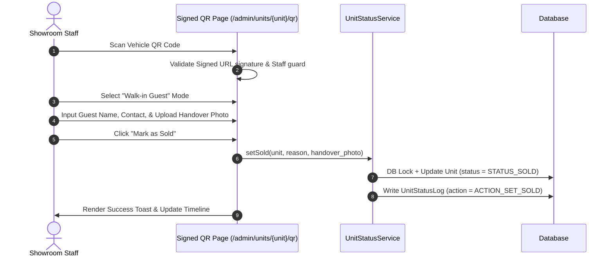
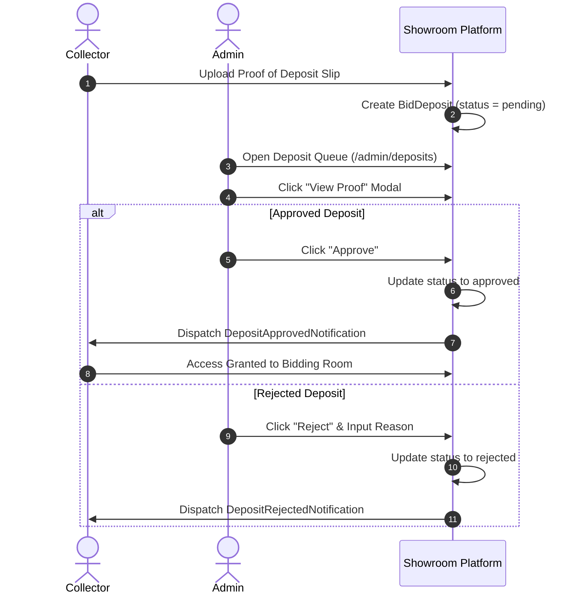

# Dealership Operational Workflows

## 1. Guest Walk-in Sale & Handover Workflow

```mermaid
sequenceDiagram
    autonumber
    actor Staff as Showroom Staff
    participant QR as Signed QR Page (/admin/units/{unit}/qr)
    participant Svc as UnitStatusService
    participant DB as Database

    Staff->>QR: Scan Vehicle QR Code
    QR->>QR: Validate Signed URL signature & Staff guard
    Staff->>QR: Select "Walk-in Guest" Mode
    Staff->>QR: Input Guest Name, Contact, & Upload Handover Photo
    Staff->>QR: Click "Mark as Sold"
    QR->>Svc: setSold(unit, reason, handover_photo)
    Svc->>DB: DB Lock + Update Unit (status = STATUS_SOLD)
    Svc->>DB: Write UnitStatusLog (action = ACTION_SET_SOLD)
    QR->>Staff: Render Success Toast & Update Timeline
```

## 2. Bid Deposit Review & Qualification Workflow

```mermaid
sequenceDiagram
    autonumber
    actor Collector
    actor Admin
    participant System as Showroom Platform

    Collector->>System: Upload Proof of Deposit Slip
    System->>System: Create BidDeposit (status = pending)
    Admin->>System: Open Deposit Queue (/admin/deposits)
    Admin->>System: Click "View Proof" Modal
    alt Approved Deposit
        Admin->>System: Click "Approve"
        System->>System: Update status to approved
        System->>Collector: Dispatch DepositApprovedNotification
        Collector->>System: Access Granted to Bidding Room
    else Rejected Deposit
        Admin->>System: Click "Reject" & Input Reason
        System->>System: Update status to rejected
        System->>Collector: Dispatch DepositRejectedNotification
    end
```
